

10-second tour: Perceive → Reflex → Predict → Fuse → Optimize → Evaluate

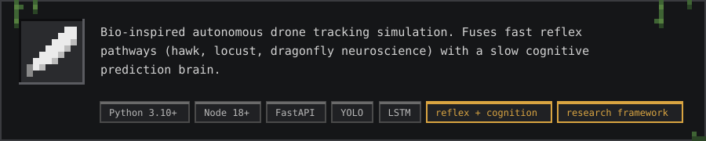


<h2></h2>

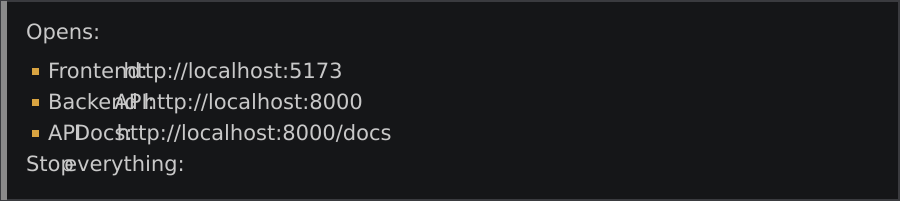

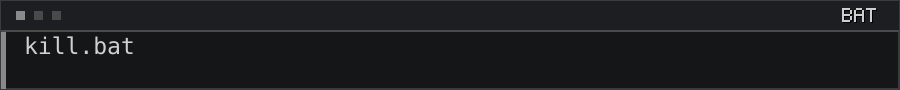

<h3></h3>

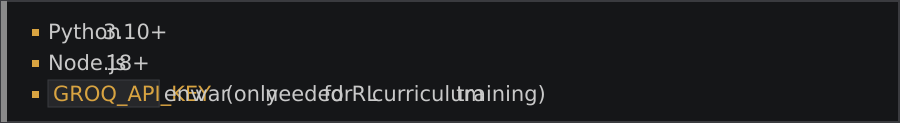

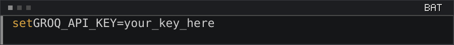

<h2></h2>

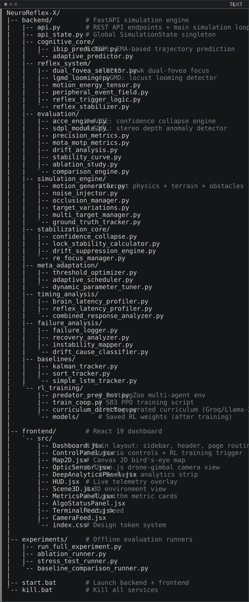

<h2></h2>

<h3></h3>

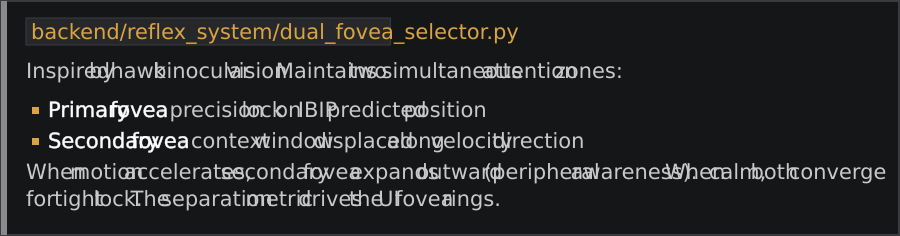

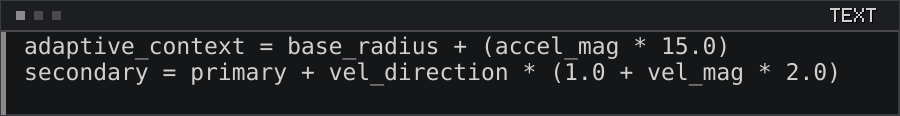

<h3></h3>

<h3></h3>

<h3></h3>

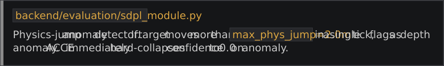

<h2></h2>

<h3></h3>

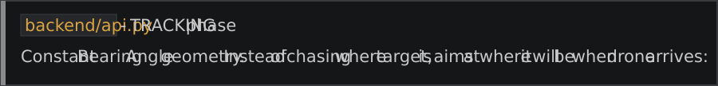

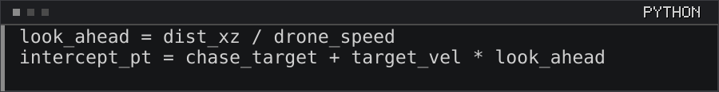

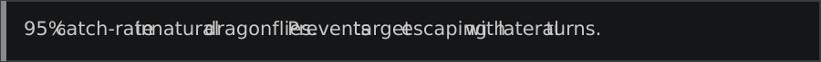

<h3></h3>

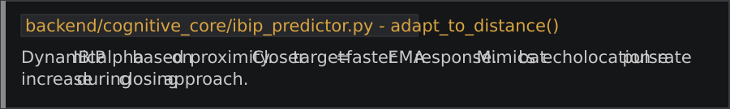

<h3></h3>

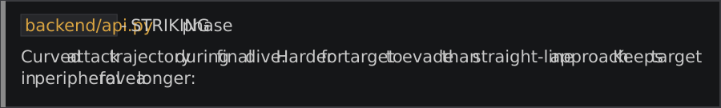

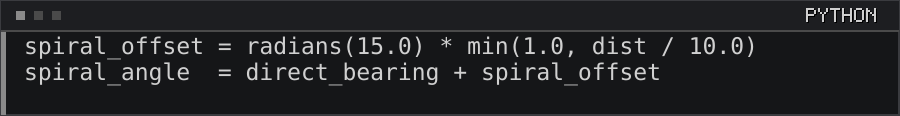

<h3></h3>

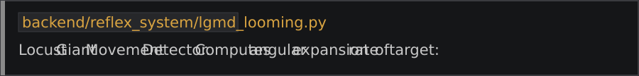

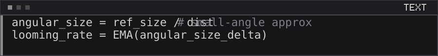

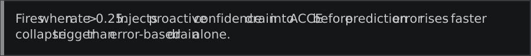

<h2></h2>

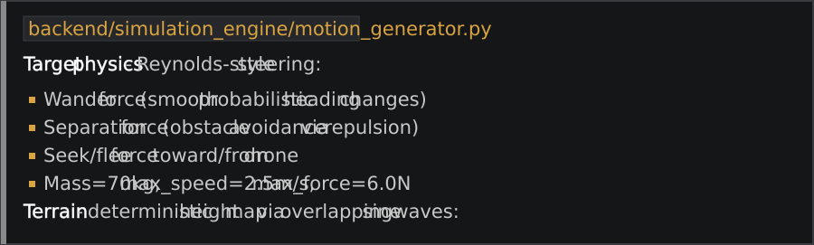

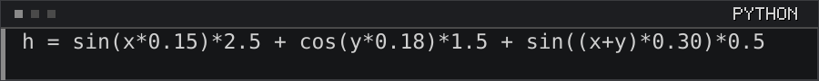

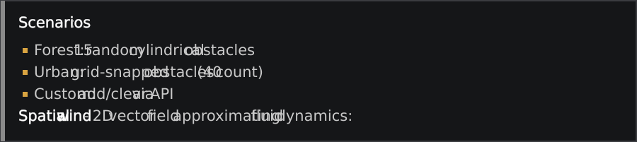

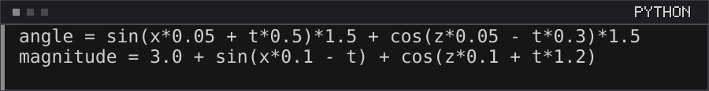

<h2></h2>

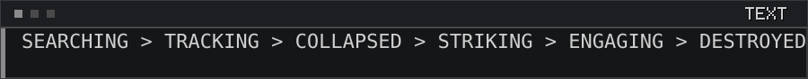

<h2></h2>

<h2></h2>

<h2></h2>

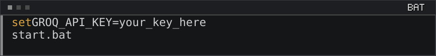

<h2></h2>

<h2></h2>

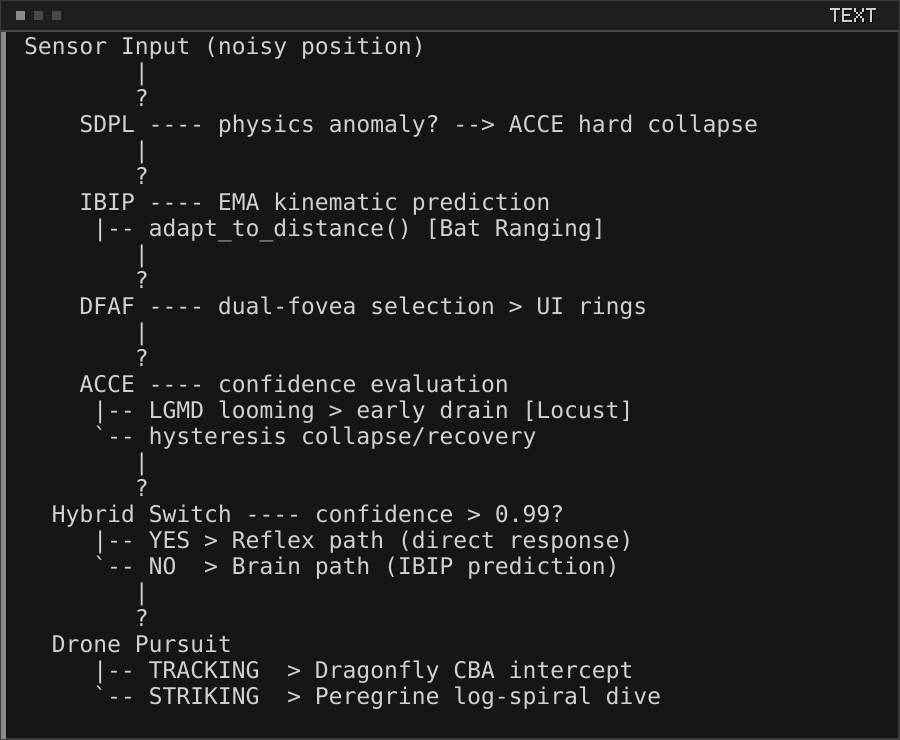

<h2></h2>

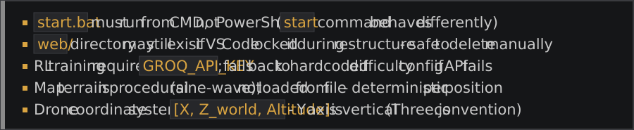

