# NeuroReflex-X — Copy-Paste Architecture Prompt

## ── Option A: Mermaid (paste at https://mermaid.live) ──

```mermaid
flowchart TD
    %% ── INPUT LAYER ──
    subgraph SIM["🔵 Simulation Engine"]
        MG[motion_generator]
        NI[noise_injector]
        OM[occlusion_manager]
        MT[multi_target_manager]
        TV[target_variations]
        GT[ground_truth_tracker]
    end

    subgraph BASE["⚫ Baselines"]
        KT[kalman_tracker]
        ST[sort_tracker]
        LT[simple_lstm_tracker]
    end

    subgraph RL["🟣 RL Training — PPO"]
        PPE[predator_prey_env]
        TC[train_coop]
        CD[curriculum_director]
        MODEL[drone_brain_cell_v1]
    end

    subgraph CFG["Config"]
        SC[system_config.yaml]
        SIM2[simulation_config.yaml]
    end

    subgraph FE["🟢 Frontend — React/Vite"]
        DASH[Dashboard]
        S3D[Scene3D]
        HUD[HUD]
        ASP[AlgoStatusPanel]
        MP[MetricsPanel]
        SC2[SimulationCanvas]
        CF[CameraFeed]
        MAP[Map2D]
        CP[ControlPanel]
        TF[TerminalFeed]
    end

    %% ── CORE PROCESSING ──
    subgraph DFAF["🔴 Reflex System — DFAF"]
        DFS[dual_fovea_selector]
        LGL[lgmd_looming]
        MET[motion_energy_tensor]
        PEF[peripheral_event_field]
        RS[reflex_stabilizer]
        RTL[reflex_trigger_logic]
    end

    subgraph IBIP["🟢 Cognitive Core — IBIP"]
        IBP[ibip_predictor]
        AP[adaptive_predictor]
    end

    subgraph COGSYS["🟢 Cognitive System"]
        AFE[attention_fusion_engine]
        ILP[intent_lstm_predictor]
        TMB[temporal_memory_bank]
        TO[trajectory_optimizer]
        DLM[depth_lock_module]
    end

    subgraph ACCE["🔵 Stabilization Core — ACCE + SDPL"]
        CC[confidence_collapse]
        DSE[drift_suppression_engine]
        LSC[lock_stability_calculator]
        RFM[re_focus_manager]
    end

    subgraph META["🟡 Meta Adaptation"]
        AS[adaptive_scheduler]
        DPT[dynamic_parameter_tuner]
        TO2[threshold_optimizer]
    end

    %% ── ANALYSIS ──
    subgraph EVAL["🩵 Evaluation Suite"]
        AE[acce_engine]
        SDPL[sdpl_module]
        CE[comparison_engine]
        ABL[ablation_study]
        DA[drift_analysis]
        SC3[stability_curve]
        MM[mota_motp_metrics]
        PM[precision_metrics]
    end

    subgraph FAIL["⬛ Failure Analysis"]
        DCC[drift_cause_classifier]
        FL[failure_logger]
        IM[instability_mapper]
        RA[recovery_analyzer]
    end

    subgraph TIME["🔷 Timing Analysis"]
        BLP[brain_latency_profiler]
        RLP[reflex_latency_profiler]
        CRA[combined_response_analyzer]
    end

    subgraph API["🟣 FastAPI Backend"]
        APIM[api.py · main.py · api_state.py]
        WS[WebSocket — real-time telemetry]
        REST[REST — /track /simulate /status]
    end

    subgraph EXP["Experiments"]
        RFE[run_full_experiment]
        AR[ablation_runner]
        BCR[baseline_comparison_runner]
        SSR[stress_test_runner]
    end

    subgraph OUT["📊 Output"]
        F1[fig1_comparative_accuracy]
        F2[fig2_drift_behavior]
        F3[fig3_response_time]
        F4[fig4_mode_switching]
        F5[fig5_radar_performance]
        F6[fig6_architecture]
    end

    %% ── CONNECTIONS ──
    SIM -->|raw frames + GT| DFAF
    SIM -->|raw frames| IBIP
    SIM -->|scenarios| EVAL
    BASE -->|tracking output| EVAL
    RL  -->|trained policy| IBIP
    CFG -->|params| API

    DFAF <-->|fovea signal| IBIP
    IBIP <-->|prediction| COGSYS
    COGSYS <-->|features| ACCE
    ACCE <-->|thresholds| META

    DFAF --> EVAL
    IBIP --> EVAL
    ACCE --> TIME
    COGSYS --> FAIL

    EVAL --> EXP
    FAIL --> EXP
    TIME --> EXP
    API  --> EXP

    EXP --> OUT

    API <-->|REST + WebSocket| FE

    style DFAF fill:#7C2D12,stroke:#EF4444,color:#fff
    style IBIP fill:#14532D,stroke:#22C55E,color:#fff
    style COGSYS fill:#14532D,stroke:#86EFAC,color:#fff
    style ACCE fill:#312E81,stroke:#818CF8,color:#fff
    style META fill:#713F12,stroke:#FCD34D,color:#fff
    style SIM fill:#1E3A5F,stroke:#3B82F6,color:#fff
    style RL fill:#4A044E,stroke:#A855F7,color:#fff
    style EVAL fill:#134E4A,stroke:#14B8A6,color:#fff
    style TIME fill:#0C4A6E,stroke:#0EA5E9,color:#fff
    style API fill:#1E1B4B,stroke:#6366F1,color:#fff
    style FE fill:#042F2E,stroke:#10B981,color:#fff
    style OUT fill:#0F2A1A,stroke:#10B981,color:#fff
```



---

## ── Option B: AI Image Generator Prompt (Midjourney / DALL-E / Ideogram) ──

```
Professional software architecture diagram for "NeuroReflex-X", a bio-inspired drone tracking system.
Dark navy background (#0F172A). Futuristic, clean, technical style.

Show 5 horizontal layers connected by labeled arrows:

LAYER 1 (top) — INPUT: Blue box "Simulation Engine" (motion_generator, noise_injector, occlusion_manager), 
gray box "Baselines" (Kalman, SORT, LSTM), purple box "RL Training PPO" (predator_prey_env, PPO model), 
green box "Frontend React/Vite" (Dashboard, HUD, Scene3D, MetricsPanel).

LAYER 2 — CORE ALGORITHMS: Red box "Reflex System DFAF" (dual_fovea_selector, lgmd_looming, motion_energy_tensor, 
reflex_trigger_logic), green box "Cognitive Core IBIP" (ibip_predictor, adaptive_predictor), 
green box "Cognitive System" (attention_fusion_engine, intent_lstm_predictor, temporal_memory_bank), 
indigo box "Stabilization ACCE+SDPL" (confidence_collapse, drift_suppression_engine), 
yellow box "Meta Adaptation" (threshold_optimizer, dynamic_parameter_tuner).

LAYER 3 — ANALYSIS: Teal box "Evaluation Suite" (acce_engine, mota_motp, precision_metrics, ablation_study), 
dark box "Failure Analysis" (drift_cause_classifier, failure_logger), 
blue box "Timing Analysis" (brain_latency_profiler, reflex_latency_profiler), 
purple box "FastAPI Backend" (REST endpoints, WebSocket telemetry).

LAYER 4 — EXPERIMENTS: Single wide dark box "Experiments" (run_full_experiment, ablation_runner, 
baseline_comparison_runner, stress_test_runner).

LAYER 5 (bottom) — OUTPUT: Green wide box "Output" (fig1 comparative accuracy, fig2 drift behavior, 
fig3 response time, fig4 mode switching, fig5 radar, fig6 architecture).

Bidirectional arrows between DFAF↔IBIP↔CognitiveSys↔Stabilization↔MetaAdaptation.
Downward arrows from all core modules into Evaluation/Analysis.
All boxes have rounded corners, glowing borders matching their color.
Legend at bottom. White label text. Style: IEEE conference paper diagram, dark mode.
8K resolution, ultra-detailed, no blur, sharp vector-like rendering.
```

---

## ── Option C: Draw.io / Lucidchart XML (paste File > Import > XML) ──

Paste the Mermaid code (Option A) at https://www.mermaidchart.com or https://mermaid.live
then export as SVG/PNG for lossless quality.

For Draw.io: go to https://app.diagrams.net → Extras → Edit Diagram → paste Mermaid code.
